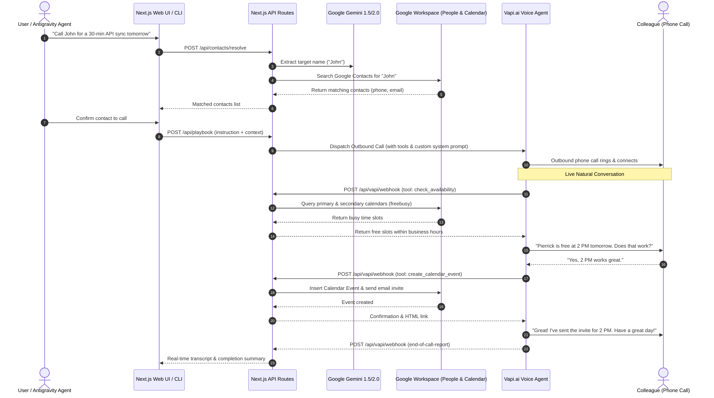

# Autonomous AI Executive Assistant (Voice + Calendar + Contacts)

An autonomous AI Executive Assistant built with **Next.js**, **Google Gemini**, **Google Workspace (Calendar & People APIs)**, and **Vapi.ai (OpenAI + Deepgram + ElevenLabs)**.

Given a natural language instruction (e.g., *"Call John and set up a 30-minute sync tomorrow afternoon to review API design"*), the assistant will:
1. Parse the request and identify the colleague's name using **Google Gemini**.
2. Look up the contact's phone number and email address using **Google Contacts (People API)**.
3. Place an outbound phone call via **Vapi.ai**.
4. Converse naturally, check your real-time **Google Calendar availability** mid-call to avoid double bookings, negotiate a mutually acceptable time slot within your business hours, and officially book the calendar invite.
5. Provide real-time transcripts, tool executions, and call summaries through both a **Custom Web UI** and an **Antigravity AI Agent Skill**.

---

## 🏗️ Architecture Flow



---

## ✨ Features

- 🧠 **Natural Language Goal Extraction**: Uses Gemini to parse target names, meeting purposes, and time preferences from unstructured prompts.
- 📇 **Google Contacts Integration**: Seamlessly searches your Google Contacts via Google People API to resolve phone numbers and emails.
- 🎙️ **Conversational Voice AI**: Powered by Vapi.ai using Deepgram Nova-2 speech-to-text, OpenAI GPT-4o-mini reasoning, and realistic ElevenLabs voice synthesis.
- 📅 **Dynamic Multi-Calendar Free/Busy Sync**: Live mid-call tool execution that inspects all connected Google Calendars to prevent double-booking.
- ⏰ **Context & Schedule Enforcement**: Configurable business hours (e.g., 9:00 AM – 5:00 PM), mandatory lunch protection (e.g., 12:00 PM – 1:00 PM), and default meeting durations.
- 📨 **Automated Event Booking & Invites**: Directly creates calendar events with formatted titles (`Requester:Colleague - Topic`) and sends Google Calendar invites to attendees.
- 📊 **Dual Control Interfaces**:
  - **Custom React Web Dashboard**: Real-time log streamer, contact selector, context settings editor, and visual call status monitors.
  - **Antigravity AI Agent Skill**: Allows the AI coding assistant to autonomously initiate calls, stream logs directly into IDE markdown artifacts, and summarize call outcomes.

---

## 📋 Prerequisites

Before running the application, make sure you have:

1. **Node.js**: v18.0.0 or higher ([Download Node.js](https://nodejs.org/)).
2. **Google Cloud Console Account**:
   - An active Google Cloud project with the **Google Calendar API** and **Google People API** enabled.
   - An OAuth2 Access Token (`GOOGLE_ACCESS_TOKEN`) with `calendar` and `contacts.readonly` scopes (or service account).
3. **Google Gemini API Key**:
   - Obtain a key from [Google AI Studio](https://aistudio.google.com/).
4. **Vapi.ai Account**:
   - An account on [Vapi.ai](https://vapi.ai/).
   - An active Vapi Phone Number ID and Private API Key.
5. **ngrok** (or public webhook tunnel):
   - [ngrok](https://ngrok.com/) to expose local port 3000 to receive Vapi webhooks.

---

## ⚙️ Environment Variables Setup

Create a `.env.local` file in the root directory by copying the provided template:

```bash
cp .env.example .env.local
```

Populate `.env.local` with your credentials:

```env
# Google Authentication (OAuth2 Access Token with People and Calendar scopes)
GOOGLE_ACCESS_TOKEN="ya29.a0A..."

# Google Gemini API Key
NEXT_PUBLIC_GEMINI_API_KEY="AIzaSy..."

# Vapi API Credentials
VAPI_API_KEY="your-vapi-api-key"
VAPI_PHONE_NUMBER_ID="your-vapi-phone-number-id"

# Webhook Tunnel URL (ngrok)
NEXT_PUBLIC_BASE_URL="https://your-tunnel-url.ngrok-free.app"

# Testing Account Overrides (Used when calling testing fallback)
TESTING_PHONE_NUMBER="+1234567890"
TESTING_EMAIL="test@example.com"
TESTING_NAME="John Doe"
```

> [!TIP]
> **Automatic ngrok Detection**: The backend includes automatic local tunnel discovery. If ngrok is running locally on port `4040` (`http://127.0.0.1:4040/api/tunnels`), the server will automatically resolve the active public URL even if `NEXT_PUBLIC_BASE_URL` changes.

---

## 🚀 Quickstart & Local Setup

### 1. Install Dependencies
```bash
npm install
```

### 2. Start the ngrok Webhook Tunnel
In a separate terminal window, start ngrok pointing to port 3000:
```bash
ngrok http 3000
```

### 3. Start the Next.js Development Server
```bash
npm run dev
```

The application is now running at `http://localhost:3000`.

---

## 🖥️ Usage Guide: Option A — Custom Web Dashboard

Open `http://localhost:3000` in your web browser:

```
┌─────────────────────────────────────────────────────────────┐
│                   AI Assistant Caller                       │
│  Test my scheduling skills with real-time phone calls       │
├─────────────────────────────────────────────────────────────┤
│  [Context Settings ▼]                                       │
│  Business Start: 9:00 AM       Business End: 5:00 PM        │
│  Lunch Start:    12:00 PM      Lunch End:    1:00 PM        │
│  Default Duration: 30-minute                                │
├─────────────────────────────────────────────────────────────┤
│  [ Test Me: Call John Doe from Engineering ]                │
├─────────────────────────────────────────────────────────────┤
│  Confirm Contact:                                           │
│  • John Doe (john.doe@example.com | +1415...) [Call]        │
│  • Call Testing Account instead               [Call Test]   │
├─────────────────────────────────────────────────────────────┤
│  Call Status & Logs                            [Clear Logs] │
│  [15:37:25] STATUS: started                                 │
│  🤖 Agent: Hi John, this is Will calling on behalf of...    │
│  👤 User: Yes, I have a minute.                             │
│  🛠️ Tool Called: check_availability                         │
│  ✅ Tool Result: Free between 2:00 PM - 3:00 PM             │
│  🛠️ Tool Called: create_calendar_event                      │
│  ✅ Tool Result: Event created successfully                 │
│  📞 Call Ended: Completed                                   │
└─────────────────────────────────────────────────────────────┘
```

### Step-by-Step Instructions:

1. **Configure Context Settings**:
   - Expand the **Context Settings** panel.
   - Adjust your work hours (e.g. `8:30 AM` to `5:30 PM`), lunch blackout period (`12:00 PM` to `1:00 PM`), or preferred meeting duration (`15-minute`, `30-minute`, `45-minute`).
2. **Trigger an Instruction**:
   - Click the canned test button or enter an instruction.
   - The system calls `/api/contacts/resolve` and parses the colleague's name using Gemini.
3. **Confirm the Contact**:
   - The UI displays matching contacts retrieved from your Google Contacts.
   - Click **"Call this contact"** to dial the real number, or click **"Call Testing Account"** to safely route the call to your configured test phone number (`TESTING_PHONE_NUMBER`).
4. **Monitor Live Call & Tool Execution**:
   - The **Call Status & Logs** terminal polls `/api/vapi/webhook` every 3 seconds.
   - Watch live speech-to-text transcripts, status updates, Google Calendar availability tool calls, and event creation confirmations in real time.
5. **Clear Logs**:
   - Click the **"Clear Logs"** button to wipe memory logs and reset the dashboard.

---

## 🤖 Usage Guide: Option B — Antigravity AI Agent Skill (`vapi-caller`)

This repository comes pre-packaged with an autonomous Antigravity Skill located at [`.agents/skills/vapi-caller/SKILL.md`](file:///.agents/skills/vapi-caller/SKILL.md).

When working in the Antigravity IDE, you can trigger phone calls simply by speaking or typing naturally in chat.

### 1. Triggering via Chat Prompt
You can say:
> *"Call John and set up a meeting with him for tomorrow afternoon to go over the API design details."*

The AI assistant will autonomously execute the workflow:

1. **Step A: Resolve Contact**
   - The agent writes the instruction to `scratch/vapi_instruction.txt` and runs:
     ```bash
     node .agents/skills/vapi-caller/scripts/resolve.js
     ```
   - Matches from Google Contacts are retrieved. If no contact is found, the agent asks if you want to proceed with the testing account.
2. **Step B: User Confirmation**
   - The agent pauses to ask: *"I found John Doe (+1415...). Would you like to call this contact or the testing account?"*
   - You reply: *"Yes"* or *"Use testing account"*.
3. **Step C: Dispatch Call**
   - The agent writes the trigger payload to `scratch/vapi_trigger.json` and runs:
     ```bash
     node .agents/skills/vapi-caller/scripts/trigger.js
     ```
4. **Step D: Live Artifact Streaming & Summary**
   - The agent immediately starts a background daemon:
     ```bash
     node .agents/skills/vapi-caller/scripts/stream_logs.js "<path-to-artifacts>/live_call_logs.md"
     ```
     You receive a clickable link to view the live updating Markdown transcript.
   - The agent launches `wait_for_call_end.js` and automatically wakes up upon call completion to deliver a concise, human-focused summary:
     ```markdown
     ### Call Summary
     * **Contact Called:** John Doe
     * **Outcome:** Successfully scheduled meeting to discuss API design.
     * **Scheduled Time:** Tomorrow (Friday) at 2:00 PM – 2:30 PM EDT.
     * **Status:** Google Calendar invite sent.
     ```

---

## 🛠️ Direct CLI Usage (Headless / Scripting)

You can also trigger and test calls directly from the command line without the web UI or IDE skill:

### 1. Resolve a Contact via CLI
```bash
node .agents/skills/vapi-caller/scripts/resolve.js "Call John Doe about the deployment"
```

### 2. Dispatch a Call via CLI
```bash
# Call the configured testing phone number:
node .agents/skills/vapi-caller/scripts/trigger.js "Call John Doe to discuss the new API architecture" "TESTING"

# Or call a specific phone number directly:
node .agents/skills/vapi-caller/scripts/trigger.js "Call Jane to reschedule our 1:1" "+1234567890" "jane@example.com"
```

### 3. Stream Live Logs to a File
```bash
node .agents/skills/vapi-caller/scripts/stream_logs.js "./call_log.md"
```

### 4. Wait for Call Completion
```bash
node .agents/skills/vapi-caller/scripts/wait_for_call_end.js
```

---

## 🔧 Technical Details & API Routes

| Endpoint | Method | Description |
| :--- | :---: | :--- |
| **`/api/contacts/resolve`** | `POST` | Uses Gemini 1.5 Flash to extract person names from natural text, then queries Google People API to fetch phone & email. |
| **`/api/playbook`** | `POST` | Assembles the complete Vapi assistant configuration with custom instructions, timezone, business hours, and tool declarations, then initiates the outbound call. |
| **`/api/vapi/webhook`** | `POST` | Receives live webhook events from Vapi. Intercepts `check_availability` and `create_calendar_event` tool calls, queries/updates Google Calendar, and returns results synchronously to the ongoing call. |
| **`/api/vapi/webhook`** | `GET` | Returns stored in-memory call logs and transcripts for frontend polling. |
| **`/api/vapi/webhook`** | `DELETE`| Clears stored in-memory call logs. |
| **`/api/calendar`** | `POST` | Helper endpoint for direct calendar free/busy lookups. |

---

## 🔒 Security Best Practices

1. **Keep Secrets Private**: Never commit `.env.local` or real API keys to version control. The repository's `.gitignore` is preconfigured to ignore all environment files and scratch logs.
2. **Client-Side Keys**: The demo uses `NEXT_PUBLIC_GEMINI_API_KEY` for client-side experimental live audio demonstrations. For production deployments, proxy all Gemini calls through a backend API route.
3. **Webhook Security**: In production, configure and verify `VAPI_WEBHOOK_SECRET` in `/api/vapi/webhook` to validate that requests originate exclusively from Vapi.
4. **Google OAuth Tokens**: For long-term production use, implement a full OAuth2 refresh token flow (e.g., using NextAuth.js) rather than static 1-hour access tokens.

---

## 📄 License

MIT License. Feel free to use and adapt this project for your own autonomous AI voice workflows.
